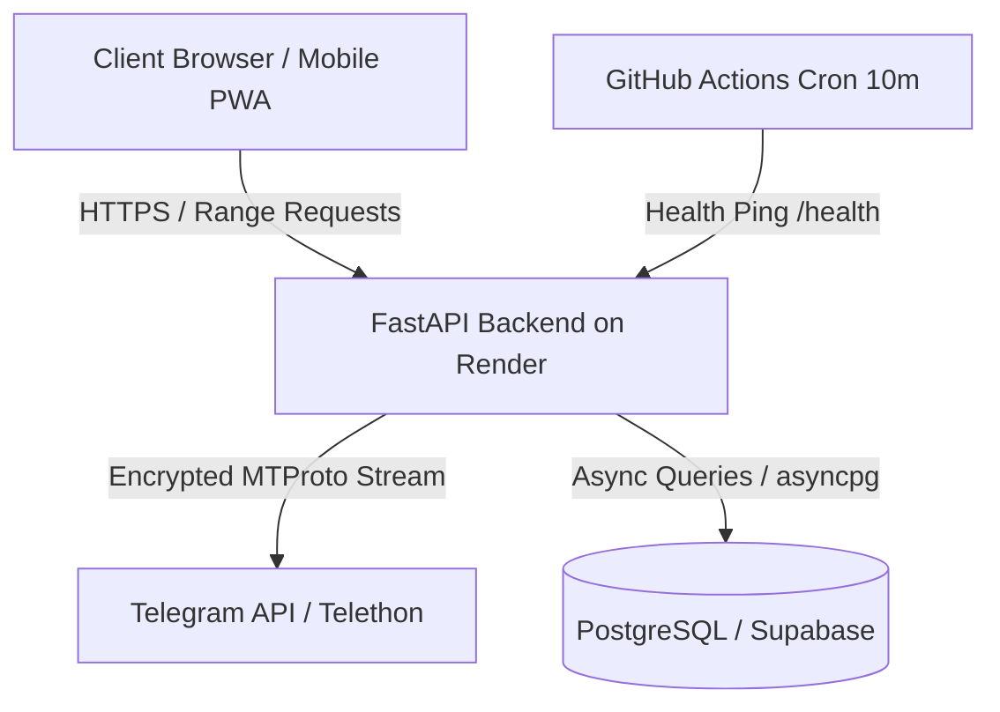

# 🎓 TeleLearn

> Transform any Telegram Channel or Forum into a modern, beautifully structured, and high-performance video learning platform.

[](https://fastapi.tiangolo.com)
[](https://react.dev)
[](https://www.typescriptlang.org)
[](https://vitejs.dev)
[](https://tailwindcss.com)
[](https://supabase.com)
[](https://render.com)

---

## ✨ Features

- **⚡ Zero-Disk Live Video Streaming**: Streams video lectures directly from Telegram with HTTP Range support (`206 Partial Content`), instant scrubber seeking, and device-level chunk caching.
- **📁 Automatic Course Hierarchy**: Automatically extracts topics, sub-modules, video lectures, and PDF/photo notes from Telegram broadcast channels and forum groups.
- **📱 Native-Quality Video Player**:
  - Center single-tap to Play / Pause with dynamic feedback animation.
  - Double-tap on left/right to skip **10s backward / forward** (optimized for mobile touch).
  - Hover-activated skip buttons for desktop.
  - Multi-speed playback (`1x`, `1.25x`, `1.5x`, `2x`), buffer parallelism toggle (`⚡ 1x/2x/3x`), volume controls, and fullscreen toggle.
  - 1-click full file video download for offline studying.
- **📊 Study Analytics & Streak Tracking**:
  - Real-time tracking of total study hours, today's study time, and active daily streak.
  - Progress tracking per course and per lesson with automatic completion marking (>= 90% watched).
  - "Continue Watching" shelf with exact timestamp resumption.
- **📑 Bookmarks & Offline Notes**: Bookmark any lesson or study material across courses.
- **🎨 Warm Aesthetic UI**:
  - Eye-friendly warm light mode (`#F3EFE5`) and deep midnight dark mode (`#0B1120`).
  - Fluid top navigation on desktop and bottom bar on mobile.
- **🚀 High Performance (SWR Client Caching & Background Prefetching)**:
  - Instant navigation via client-side cache and automatic background revalidation.
- **🛡️ Enterprise Security**:
  - Zero plain-text Telegram sessions: Session strings are encrypted using **Fernet symmetric encryption** before saving to PostgreSQL.
  - Row Level Security (RLS) enabled on all database tables.
- **⏰ Automated Keep-Alive**: Included GitHub Actions workflow pings the backend every 10 minutes to prevent Render free tier spin-down.

---

## 🏗️ Architecture



---

## 🛠️ Tech Stack

- **Backend**: Python 3.12, FastAPI, Telethon (MTProto), SQLAlchemy (Async), asyncpg, Cryptography (Fernet), uvicorn, aiofiles
- **Frontend**: React 19, TypeScript, Vite, TailwindCSS v4, Lucide Icons, Axios
- **Database**: PostgreSQL (Supabase / Render Postgres)
- **Deployment**: Render (Blueprint Web Service + Static Site) or Vercel + Render

---

## 🚀 Quick Start (Local Development)

### 1. Prerequisites
- Python 3.10+
- Node.js 18+ and npm
- Telegram API Credentials (`API_ID` and `API_HASH` from [my.telegram.org](https://my.telegram.org))

### 2. Backend Setup
```bash
cd backend
python -m venv venv

# Windows
venv\Scripts\activate
# Linux/macOS
source venv/bin/activate

pip install -r requirements.txt
```

Create `backend/.env`:
```env
DATABASE_URL=sqlite+aiosqlite:///telelearn.db
ENCRYPTION_KEY=bSHtwD22ewQx70FxoKXPTobfkh-FgDcL2jlsxIDNbBM=
TELEGRAM_API_ID=34979954
TELEGRAM_API_HASH=55a2f5c696725c26d9b2373e7c1ba1ad
```

Start backend:
```bash
uvicorn main:app --reload --port 8000
```

### 3. Frontend Setup
```bash
cd ../frontend
npm install
npm run dev
```

Open [http://localhost:5173](http://localhost:5173) in your browser.

---

## ☁️ Cloud Deployment

### 1-Click Deployment with Render Blueprint

1. Push this repository to your GitHub account.
2. Open the [Render Dashboard](https://dashboard.render.com/) $\rightarrow$ **New +** $\rightarrow$ **Blueprint**.
3. Connect your repository. Render will automatically detect [`render.yaml`](render.yaml) and configure:
   - **`telelearn-backend`**: Python FastAPI Web Service
   - **`telelearn-frontend`**: Static Site with client-side SPA routing
4. Provide your secret environment variables:
   - `DATABASE_URL`: `postgresql+asyncpg://<user>:<password>@<host>:5432/<dbname>`
   - `ENCRYPTION_KEY`: 32-byte url-safe base64 string (generate with `python -c "from cryptography.fernet import Fernet; print(Fernet.generate_key().decode())"`)
5. Click **Apply**.

### Deploy Frontend on Vercel (Alternative)
1. Import repository in [Vercel](https://vercel.com).
2. Set Root Directory to `frontend`.
3. Add Environment Variable:
   - `VITE_API_HOST`: `https://telelearn-backend.onrender.com`
4. Click **Deploy**.

---

## 🔐 Environment Variables

| Variable | Scope | Description |
|---|---|---|
| `DATABASE_URL` | Backend | PostgreSQL connection string with `postgresql+asyncpg://` driver |
| `ENCRYPTION_KEY` | Backend | 32-byte Fernet key for Telegram session encryption |
| `TELEGRAM_API_ID` | Backend | Telegram API ID from [my.telegram.org](https://my.telegram.org) |
| `TELEGRAM_API_HASH` | Backend | Telegram API Hash from [my.telegram.org](https://my.telegram.org) |
| `VITE_API_HOST` | Frontend | Backend API base URL (e.g. `https://telelearn-backend.onrender.com`) |

---

## ⏰ Keep-Alive Setup (Prevent Render Sleep)

Render Free tier spins down web services after 15 minutes of inactivity. TeleLearn includes an automated GitHub Actions workflow (`.github/workflows/keep_alive.yml`) that executes every **10 minutes**:
- Pings `https://telelearn-backend.onrender.com/health`
- Pings `https://telelearn.onrender.com/health`
- Keeps your streaming backend instantly responsive 24/7 at $0 cost.

*(Optional)*: If using a custom domain, add `RENDER_BACKEND_URL` in your GitHub Repository Settings $\rightarrow$ **Secrets and variables** $\rightarrow$ **Actions**.

---

## 📄 License
MIT License. Built for educational and productivity purposes.
